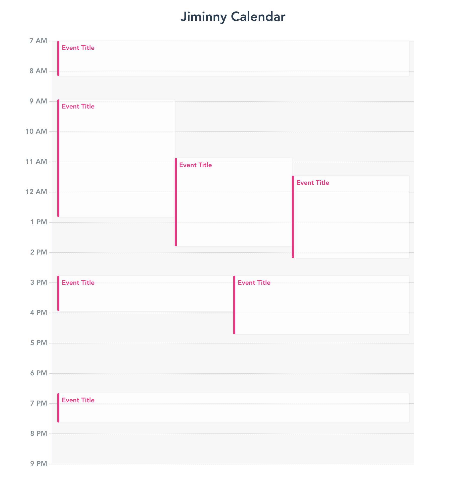

# FT Calendar



**FT Calendar** is a web app designed to display calendar events for a specific day (from 7AM to 9PM). Each event has **startTime** and **endTime** attributes and they represent the time in minutes from the start of the day. For instance `{ startTime: 60, endTime: 150 }` represents an event which start at 08:00AM and ends at 09:30AM. In the `events.json` file you'll find an exemplary dataset of events. The events MUST not visually overlap. If two or more events collide, they MUST have the same width.

## Design

- The events' container should be 720px wide and 840px long.
- The styling of the events should match the one from the screenshot.
- The labels on the time axis should have dotted grid lines. These are lines extending the ticks across the plot area.

## Events Data

You will fetch events data from a REST service. To start the service run `npm start` after installing npm dependencies. When it starts it outputs the resource URI (e.g. `http://localhost:3000/events`)

## Project setup
```
yarn install
```

### Compiles and hot-reloads for development
```
yarn serve
```

### Compiles and minifies for production
```
yarn build
```

### Run your unit tests
```
yarn test:unit
```

### Lints and fixes files
```
yarn lint
```
